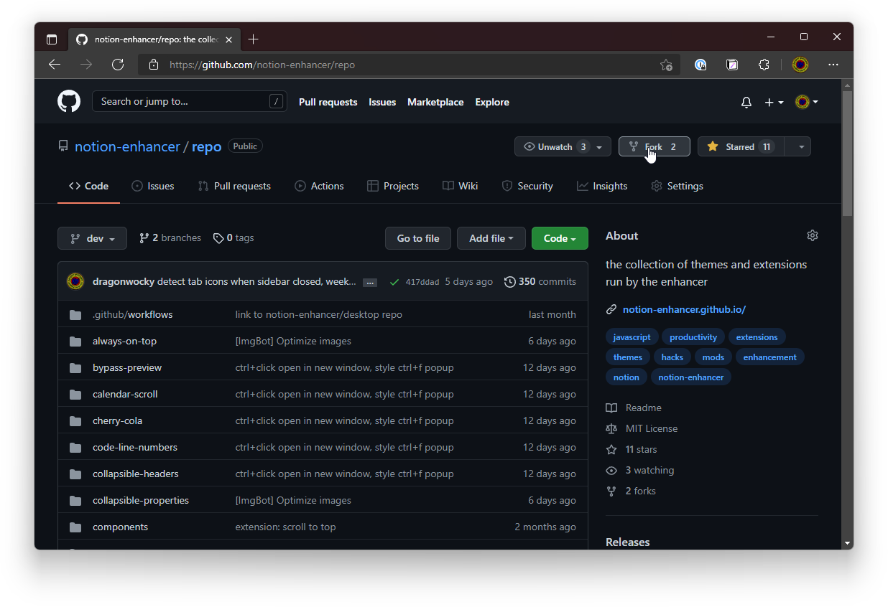
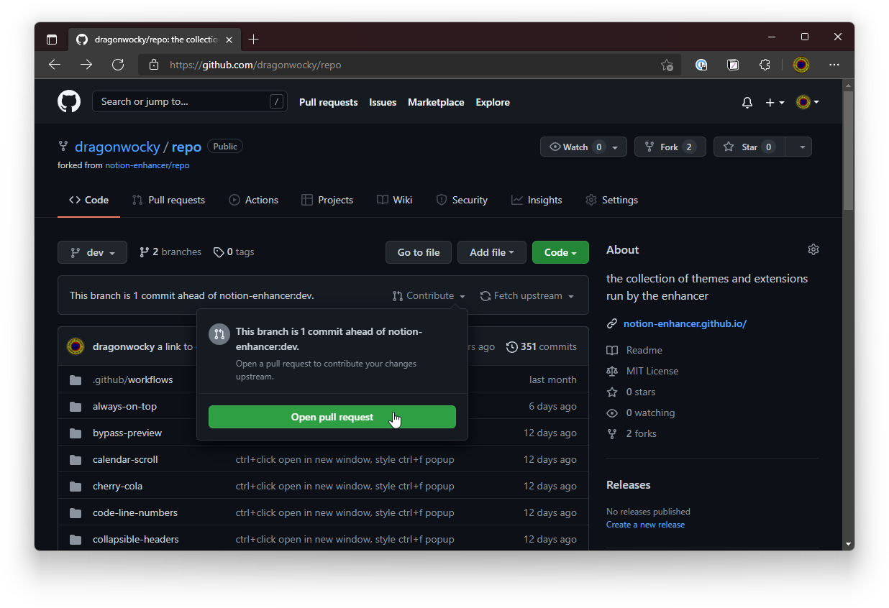
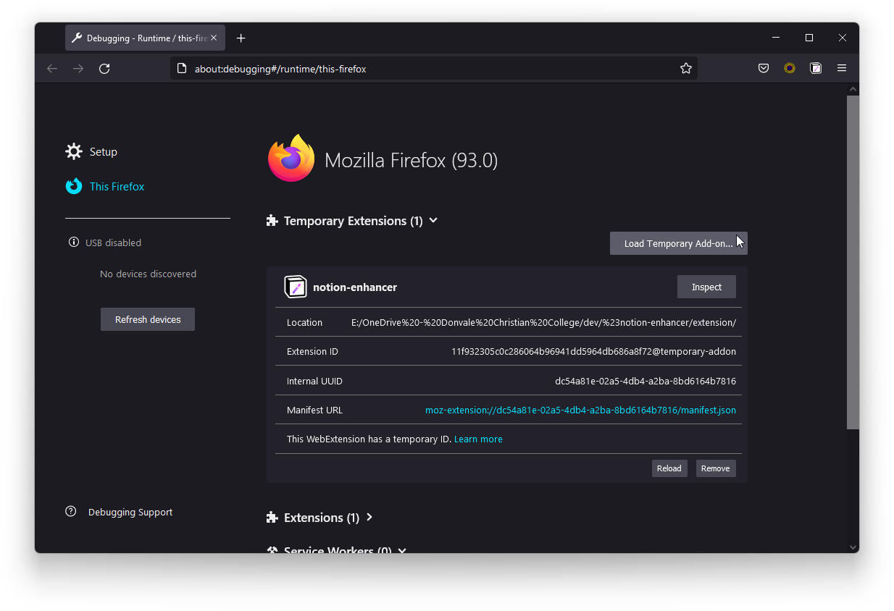

# Contributing

The notion-enhancer is an open source project that accepts community
contributions. This page outlines some guidelines to enable smooth
communication around and development of changes to this project.
Following them respects the authors of the project and maintains
the quality of the notion-enhancer.

## Bug Reports

If something isn't working as expected, you can create a bug
report to let the developers know.

Bug reports should be made in the relevant GitHub repository
and marked with the `bug` tag.

- If an **individual mod** isn't working or the issue occurs in **multiple environments**,
  create an issue in the [notion-enhancer/repo](https://github.com/notion-enhancer/repo/issues)
  repository ← _If in doubt, choose this one_.

- If there's an **environment-specific problem**
  (e.g. something wrong with installing the notion-enhancer),
  create an issue in the repository for that environment:

  - If you installed a pre-enhanced app, create an issue in the
    [notion-enhancer/notion-repackaged](https://github.com/notion-enhancer/notion-repackaged/issues)
    repository.

  - If you installed a browser extension, create an issue in the
    [notion-enhancer/extension](https://github.com/notion-enhancer/extension/issues)
    repository.

  - If you manually enhanced a desktop app, create an issue in the
    [notion-enhancer/desktop](https://github.com/notion-enhancer/desktop/issues)
    repository.

Bug reports should contain the following. Bug reports without enough
information may be ignored or rejected.

- Compare **what is happening** with **what should be happening**
  to explain why this is a bug. If applicable provide screenshots.
- Provide diagnostic information:
  - Your operating system name & version
    OR browser name & version.
  - Your notion-enhancer version.
  - Your notion-enhancer configuration (enabled/disabled mods
    and their settings).

Before creating a bug report, please check:

- **Is this an actual bug, or do I just need help with something?**
  If you just need help, come ask in one of the support channels
  on [Discord](https://discord.gg/sFWPXtA) instead.

- **Has this bug already been reported?**
  You can use the search bar to filter existing issues
  and add extra information or a +1 to someone else's
  bug report. Duplicate bug reports make responding to
  and fixing bugs efficiently difficult.

- **Is this a security issue? (e.g. a vulnerability or data breach)**
  Please contact the authors privately about this first,
  so it can be resolved safely without publicising
  something that could be taken advantage of and
  used against other users. You can get in touch by
  direct messaging `dragonwocky#8449` on Discord or
  emailing [thedragonring.bod@gmail.com](mailto:thedragonring.bod@gmail.com).

## Feature Requests

If you have an idea for a new notion-enhancer feature
or an extra option for an existing feature, you can
create a feature requests to suggest it to the developers.

Feature requests should be made to the
[notion-enhancer/repo](https://github.com/notion-enhancer/repo/issues)
repository and marked with the `feature request` tag.

Features must fit the following guidelines. Features that
do not fit them will be rejected as out of scope.

- Features must be **useful** and **relevant**: highly individualised/niche
  features aren't worth the time and effort to implement, and
  some things just don't need to be done through the notion-enhancer
  (e.g. password management or music).
- Features must be **enhancing, not adding**: the notion-enhancer can modify
  Notion's appearance and simplify or process pre-existing information/features,
  but cannot create entirely new features (e.g. it can change the appearance of
  existing tags, but couldn't add an extra tag colour alongside the defaults).
- Features must be **client-only** (e.g. enabling a theme doesn't mean that anyone
  else who looks at one of your shared/public pages will see it with the same theme).

Feature requests should contain the following. Feature requests
without enough information may be ignored or rejected.

- **What makes the feature necessary?** What problem does it fix?
  Include some example situations the feature would be used in.
- **How would the feature work?** Describe how users would interact with
  the feature, what it would do in response and how it might appear.
  If possible, suggesting a technical implementation or providing visual
  mockups would be appreciated.

It may be worth reading through the
[Concepts](../documentation/concepts.md)
page to gain an understanding of the notion-enhancer's
abilities and limitations.

## Code Contributions

Community-coded bug fixes and features are welcome! If you would like
to work on something, please let us know in the relevant GitHub issue
for that bug or feature, so we can mark it as work-in-progress.
If you would like to build a feature that has not yet been requested,
please open a feature request for it first so we can approve it as in-scope
(see the feature request guidelines above).

By contributing to the notion-enhancer, you agree that any/all
code and files you submit are your own and if included in the
notion-enhancer will be licensed and distributed under the
notion-enhancer's [Terms & Conditions](./terms-and-conditions.md).

### Development Environment

The notion-enhancer is split up across a number of GitHub
repositories to enable cross-environment development. By using
git submodules, the [notion-enhancer/api](https://github.com/notion-enhancer/api),
[notion-enhancer/repo](https://github.com/notion-enhancer/repo),
[notion-enhancer/dep](https://github.com/notion-enhancer/dep),
and [notion-enhancer/media](https://github.com/notion-enhancer/media) repositories
are included in both the [notion-enhancer/desktop](https://github.com/notion-enhancer/desktop)
and [notion-enhancer/extension](https://github.com/notion-enhancer/extension) repositories.
An auto-update system pushes any commits to the submodules to the
parent repositories' `dev` branches straightaway. To avoid
conflicts, this means development must only occur on one of the above
submodules or repositories at once. For the majority of contributions,
this should not be a problem, but it is something to be aware of.

#### Prerequisites

- [Git](https://git-scm.com/) v2.0.0+
- A [GitHub](https://github.com/) account
- _Extension_ → the latest version of Firefox or a Chromium-based browser.
- _Desktop_ → [Node.js](https://nodejs.org/en/) v16.0.0+
- _Desktop_ → [Yarn](https://yarnpkg.com/) v1.22.0+
- _Desktop_ → A default installation of the [official Notion app](https://www.notion.so/desktop)

#### Git Setup

1. Make a fork of the repository you would like to contribute to
   (e.g. [notion-enhancer/repo](https://github.com/notion-enhancer/repo/fork)).

   

2. Open a command line and clone either the
   [notion-enhancer/desktop](https://github.com/notion-enhancer/desktop) or
   [notion-enhancer/extension](https://github.com/notion-enhancer/extension) repository:

   ```
   git clone --recurse-submodules -b dev https://github.com/notion-enhancer/desktop.git
   // or
   git clone --recurse-submodules -b dev https://github.com/notion-enhancer/extension.git
   ```

3. Navigate to the directory of the repository you are contributing to
   (e.g. `desktop/insert/repo` or `extension/repo`) and link it to your fork:

   ```
   git checkout dev
   git remote set-url origin https://github.com/your_github_username/your_fork_name.git
   // e.g. git remote set-url origin https://github.com/dragonwocky/repo.git
   git fetch
   ```

4. Make and test your changes ([see below](#extension-testing)).

5. Return to the directory you were in in step #3 to save your changes and
   upload them to GitHub with a suitable commit message:

   ```
   git add .
   git commit -m "summary of changes"
   git push
   ```

6. Open your fork of the repository and create a pull request:

   

   Pull requests should contain the following. Pull requests
   without enough information may be ignored or rejected.

   - The [bug report](#bug-reports) or [feature request](#feature-requests)
     that your changes are addressing.
   - An explanation of what your code does and why you have chosen
     to implement it that way.

   Once the pull request has been submitted, it will be reviewed by the
   notion-enhancer maintainers and merged when it is ready. Reviewers may
   request changes - new changes committed & pushed to GitHub (see step #5)
   will become part of the pull request automatically.

#### Extension Testing

After making your changes, you can load the extension into your browser
as a temporary/debuggable extension. Once you have linked it, new changes
should also be applied if you reload the opened [Notion website](https://www.notion.so/)
or notion-enhancer menu.

In Chromium-based browsers (e.g. Google Chrome, Microsoft Edge) go to
your browser's extension settings page. You can find this through the menu
or by typing `chrome://extensions` into the address bar. Press "Load Unpacked"
and select the folder you cloned [notion-enhancer/extension](https://github.com/notion-enhancer/extension)
to. The extension should now be running with your changes included,
and should remain after a browser restart.


In Firefox, go to the "This Firefox" page by typing `about:debugging#/runtime/this-firefox`
into the address bar. Press "Load Temporary Add-on..." and select the `manifest.json`
file within the folder you cloned [notion-enhancer/extension](https://github.com/notion-enhancer/extension)
to. The extension should now be running with your changes included,
but will disappear after a browser restart.



#### Desktop Testing

After making your changes, navigate back to the root of the clone of the
[notion-enhancer/desktop](https://github.com/notion-enhancer/desktop)
repository and insert the notion-enhancer (including your changes)
into Notion:

```
yarn
node bin.mjs apply -y -d --no-backup --patch
```

Once relaunched, Notion will be running a version of the
notion-enhancer with your changes included. You will need to
repeat this every time you make changes.

> Note: this chain of arguments is intended for development/testing of
> mods only. It overrides previous enhancements and skips backup to
> re-insert the notion-enhancer quickly when modifying the contents
> of the `desktop/insert` folder.
>
> If you are modifying any other part of the notion-enhancer,
> e.g. the `desktop/pkg` folder, you will need to either use
> the slower `node bin.mjs apply -d -y` command or uninstall/reinstall
> the app between each enhancement attempt.

### Conventions

When contributing to the notion-enhancer, your code must
follows the guidelines below and operate according to the
notion-enhancer's [Privacy Policy](./privacy-policy.md).
This is important to maintain code quality, consistency,
readability and security.

#### Versioning

- The notion-enhancer uses [Semantic Versioning](https://semver.org/)
  (MAJOR.MINOR.PATCH) for itself and its mods.
- Mods are versioned separately to the notion-enhancer, but their
  versions may only be incremented once for every notion-enhancer
  update. Increments should represent the full scale of the
  changes a mod has experienced since the last release.
- Until the notion-enhancer reaches v1.0.0 and is fully
  stable (in terms of consistency of internal APIs) no
  individual mod can reach v1.0.0.
- Commits should be made to the `dev` branch of the repo, leaving the `main`
  branch to match the curent release of the notion-enhancer.

#### Code Style

- Descriptive file extensions (`.mjs` or `.cjs`, not `.js`) are used
  to differentiate between the different types of files executed
  by different parts of the notion-enhancer.
- [Prettier](https://prettier.io/) is used to format notion-enhancer source code
  ([VS Code extension](https://marketplace.visualstudio.com/items?itemName=esbenp.prettier-vscode)).
- `camelCase` is used to name variables and functions. HTML DOM element variable
  names should be prefixed with a `$` (e.g. `$collapsePropsButton`).
- Where possible, depend on the notion-enhancer's JavaScript API
  and CSS variables. The notion-enhancer can perform the majority
  of the repetitive/heavy work needed to enhance Notion. Depending on
  the shared API improves perform by reducing the number of event listeners
  and increases maintainability, as some patches will only need to be
  made to the notion-enhancer core rather than to every individual mod.

#### Other

- Features must be able to be cleanly enabled/disabled
  (e.g. if you were to open Notion in an unenhanced environment,
  pages should load normally and not appear corrupted or have special
  content only the notion-enhancer can read).
- At this point, the notion-enhancer is English-only. Multi-language
  support is a future possibility, but is not available yet.
- Mods should be self-contained, not depending on other mods to work.
  Optional interop between mods is welcome (e.g. custom emojis through
  the emoji sets mod also affecting emojis in tab labels).
