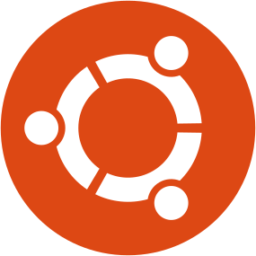
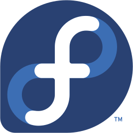

# Installation

The notion-enhancer works on MacOS, Linux and Windows.
It can be used within the desktop app or the web client
as a browser extension.

Due to system limitations, mobile clients are not and
will never be supported.

Once you've installed the notion-enhancer, read the
[Basic Usage](./basic-usage.md) page to get started with it.

> **Warning:** the new version of the notion-enhancer handles storing local
> configuration differently to previous versions. If you used notion-enhancer
> prior to v0.11.0, please delete the `.notion-enhancer` folder to prevent any
> issues that may arise.
>
> It can be found within your home/user folder, e.g. `~` on macOS and Linux
> or `C:\Users\YourName` on Windows (enabling the "show hidden files" option
> in your file manager may be necessary).

> **Warning:** though it is possible to have both vanilla Notion
> and enhanced Notion installed at once, running both at
> once may cause problems and should never be done.

## Browser Extension

Once installed, the browser extension should
update automatically.

### {.inline-icon .mr-1} Firefox →

Go to the [Firefox Add-on Store](https://addons.mozilla.org/en-US/firefox/addon/notion-enhancer/)
and click "Add to Firefox".

### {.inline-icon .mr-1} Google Chrome, {.inline-icon .mx-1} Microsoft Edge →

Go to the [Chrome Web Store](https://chrome.google.com/webstore/detail/notion-enhancer/dndcmiicjbkfcbpjincpefjkagflbbnl)
and click "Add to Chrome".

## notion-repackaged

notion-repackaged provides installable executables containing
both Notion and the notion-enhancer for all platforms.
This is the recommended method of installation.

Installations via notion-repackaged will need to be manually
updated with each new release of Notion and/or the notion-enhancer.

### {.inline-icon .mr-1} Windows →

- Installer: [`.exe`](https://github.com/notion-enhancer/notion-repackaged/releases/download/v2.0.18-1/Notion-Enhanced-Setup-2.0.18-1.exe)
- Portable build: [`.zip`](https://github.com/notion-enhancer/notion-repackaged/releases/download/v2.0.18-1/Notion-Enhanced-2.0.18-1-win.zip)

### {.inline-icon .mr-1} MacOS →

> Unfortunately, the M1 (arm64) build is currently non-functional
> due to a bug in the packager we depend on
> (see [electron-userland/electron-builder#5850](https://github.com/electron-userland/electron-builder/issues/5850)).
> This is not something we can currently fix.
> Until a solution is available, we recommend running the
> Intel build through Rosetta or using the browser extension instead.

- Intel installer: [`.dmg`](https://github.com/notion-enhancer/notion-repackaged/releases/download/v2.0.18-1/Notion-Enhanced-2.0.18-1.dmg)
- Portable Intel build: [`.zip`](https://github.com/notion-enhancer/notion-repackaged/releases/download/v2.0.18-1/Notion-Enhanced-2.0.18-1-mac.zip)

As it is a modified version of the Notion app,
it is unsigned. It may be detected as malware or
unable to be opened. To fix this, try following
[Apple's official instructions](https://support.apple.com/en-us/HT202491).

### {.inline-icon .mr-1} Linux

Both `vanilla` and `enhanced` variants are available for Linux,
as there is no official vanilla Notion app for Linux-based operating
systems.

There are a number of installation methods available depending on the
distribution you are using. For a portable, distribution-agnostic build,
try one of the below:

- x86_64 build (vanilla): [`.AppImage`](https://github.com/notion-enhancer/notion-repackaged/releases/download/v2.0.18-1/Notion-2.0.18-1.AppImage),
  [`.zip`](https://github.com/notion-enhancer/notion-repackaged/releases/download/v2.0.18-1/notion-app-2.0.18-1.zip)
- x86_64 build (enhanced): [`.AppImage`](https://github.com/notion-enhancer/notion-repackaged/releases/download/v2.0.18-1/Notion-Enhanced-2.0.18-1.AppImage),
  [`.zip`](https://github.com/notion-enhancer/notion-repackaged/releases/download/v2.0.18-1/notion-app-enhanced-2.0.18-1.zip)
- arm64 build (vanilla): [`.AppImage`](https://github.com/notion-enhancer/notion-repackaged/releases/download/v2.0.18-1/Notion-2.0.18-1-arm64.AppImage),
  [`.zip`](https://github.com/notion-enhancer/notion-repackaged/releases/download/v2.0.18-1/notion-app-2.0.18-1-arm64.zip)
- arm64 build (enhanced): [`.AppImage`](https://github.com/notion-enhancer/notion-repackaged/releases/download/v2.0.18-1/Notion-Enhanced-2.0.18-1-arm64.AppImage),
  [`.zip`](https://github.com/notion-enhancer/notion-repackaged/releases/download/v2.0.18-1/notion-app-enhanced-2.0.18-1-arm64.zip)

#### {.inline-icon .mr-1} Debian, {.inline-icon .mx-1} Ubuntu, {.inline-icon .mx-1} Pop!\_OS, {.inline-icon .mx-1} Linux Mint →

To add notion-repackaged to your package manager:

```
echo "deb [trusted=yes] https://apt.fury.io/notion-repackaged/ /" | sudo tee /etc/apt/sources.list.d/notion-repackaged.list
sudo apt update
```

The app can then be installed via:

```
sudo apt install notion-app-enhanced
// or
sudo apt install notion-app
```

Otherwise, you can download the `.deb` and install it manually:

- arm64 build (vanilla): [`.deb`](https://github.com/notion-enhancer/notion-repackaged/releases/download/v2.0.18-1/notion-app_2.0.18-1_arm64.deb)
- arm64 build (enhanced): [`.deb`](https://github.com/notion-enhancer/notion-repackaged/releases/download/v2.0.18-1/notion-app-enhanced_2.0.18-1_arm64.deb)
- amd64 build (vanilla): [`.deb`](https://github.com/notion-enhancer/notion-repackaged/releases/download/v2.0.18-1/notion-app_2.0.18-1_amd64.deb)
- amd64 build (enhanced): [`.deb`](https://github.com/notion-enhancer/notion-repackaged/releases/download/v2.0.18-1/notion-app-enhanced_2.0.18-1_amd64.deb)

```
sudo dpkg -i <downloaded file>.deb
```

#### {.inline-icon .mr-1} Fedora →

Add notion-repackaged to your package manager by creating the file
`/etc/yum.repos.d/notion-repackaged.repo` with the following contents:

```
[notion-repackaged]
name=notion-repackaged
baseurl=https://yum.fury.io/notion-repackaged/
enabled=1
gpgcheck=0
```

The app can then be installed via:

```
sudo dnf install notion-app-enhanced
// or
sudo dnf install notion-app
```

> `yum` may be used instead of `dnf`.

Otherwise, you can download the `.rpm` and install it manually:

- x86_64 build (vanilla): [`.rpm`](https://github.com/notion-enhancer/notion-repackaged/releases/download/v2.0.18-1/notion-app-2.0.18-1.x86_64.rpm)
- x86_64 build (enhanced): [`.rpm`](https://github.com/notion-enhancer/notion-repackaged/releases/download/v2.0.18-1/notion-app-enhanced-2.0.18-1.x86_64.rpm)
- aarch64 build (vanilla): [`.rpm`](https://github.com/notion-enhancer/notion-repackaged/releases/download/v2.0.18-1/notion-app-2.0.18-1.aarch64.rpm)
- aarch64 build (enhanced): [`.rpm`](https://github.com/notion-enhancer/notion-repackaged/releases/download/v2.0.18-1/notion-app-enhanced-2.0.18-1.aarch64.rpm)

```
sudo rpm -i <downloaded file>.rpm
```

#### {.inline-icon .mr-1} Arch Linux, {.inline-icon .mx-1} Manjaro →

The app can be installed from the AUR using an AUR helper (e.g. `yay`):

- [notion-app](https://aur.archlinux.org/packages/notion-app/)
- [notion-app-enhanced](https://aur.archlinux.org/packages/notion-app-enhanced/)

Otherwise, you can download the `.pacman` and install it manually:

- x86_64 build (vanilla): [`.pacman`](https://github.com/notion-enhancer/notion-repackaged/releases/download/v2.0.18-1/notion-app-2.0.18-1.pacman)
- x86_64 build (enhanced): [`.pacman`](https://github.com/notion-enhancer/notion-repackaged/releases/download/v2.0.18-1/notion-app-enhanced-2.0.18-1.pacman)
- aarch64 build (vanilla): [`.pacman`](https://github.com/notion-enhancer/notion-repackaged/releases/download/v2.0.18-1/notion-app-2.0.18-1-aarch64.pacman)
- aarch64 build (enhanced): [`.pacman`](https://github.com/notion-enhancer/notion-repackaged/releases/download/v2.0.18-1/notion-app-enhanced-2.0.18-1-aarch64.pacman)

```
sudo pacman -U <downloaded file>.pacman
```

## Manual Enhancement

If you would prefer to apply the notion-enhancer
to an existing vanilla installation of Notion,
you can use the [notion-enhancer/desktop](https://github.com/notion-enhancer/desktop)
package directly.

Manual command-line installations will need to be re-applied
with each new release of Notion and/or the notion-enhancer.

> This is not available on Linux, but can be done through
> the Windows Subsystem for Linux in order to enhance the
> Windows app.

#### Prerequisites

- [Node.js](https://nodejs.org/en/) v16.0.0+
- A default installation of the [official Notion app](https://www.notion.so/desktop)

#### {.inline-icon .mr-1} Enhancement →

1. Open a command line and install the
   [notion-enhancer NPM package](https://www.npmjs.com/package/notion-enhancer):

   ```
   npm i -g notion-enhancer
   // or
   yarn global add notion-enhancer
   ```

2. Insert the notion-enhancer into Notion:

   ```
   notion-enhancer apply
   ```

3. If you are using MacOS and experience any errors related
   to file permissions or corrupted/broken apps, run the following
   and then re-attempt step #2:
   ```
   sudo chmod -R a+wr /usr/local/lib/node_modules
   sudo chmod -R a+wr /usr/local/bin
   sudo chmod -R a+wr /Applications/Notion.app/Contents/Resources
   xcode-select --install
   codesign --force --deep --sign - /Applications/Notion.app
   ```
